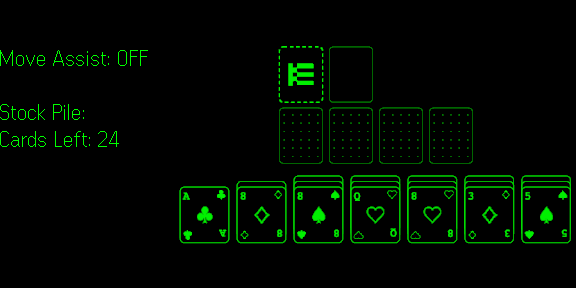
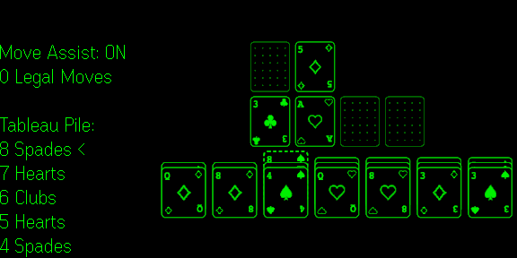
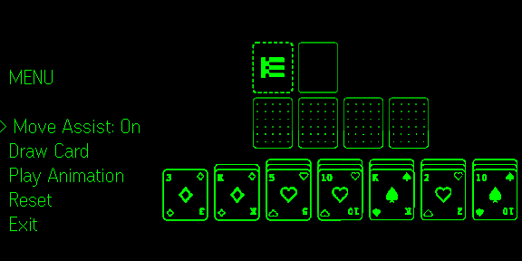

# Solitaire

Klondike Solitaire for **Even Realities G2** smart glasses. Three gestures run the whole game: scroll, tap, double-tap. Piles and status live in a text panel rather than a board overlay, and Move Assist points you at legal destinations so you scroll less.

This project is licensed under the MIT License. See [LICENSE](LICENSE).

## Screenshots

| Main View | Gameplay | Menu |
|:---------:|:--------:|:----:|
|  |  |  |

## Quick links

- **In-app help:** Open the app URL on your phone to see the full instructions (getting started, controls, rules, menu, save/resume). Same content as [index.html](index.html) in this repo.
- **On-device smoke checklist:** Quick runtime regression pass for glasses behavior in [docs/on-device-smoke-checklist.md](docs/on-device-smoke-checklist.md).
- **Performance design notes:** Architecture and tuning choices from perf/responsiveness passes in [docs/performance-responsiveness-design.md](docs/performance-responsiveness-design.md).

## Tech stack

- **Runtime:** TypeScript, Vite
- **Game rules / engine:** Internal Klondike engine in `src/game/` (deal, validation, moves, win detection)
- **Glasses:** [Even Hub SDK](https://www.npmjs.com/package/@evenrealities/even_hub_sdk) for containers, image/text updates, and event mapping
- **Rendering:** Canvas-based board rendering + composed image tiles for G2 layouts
- **Tests:** Vitest

## Project structure

```text
Solitaire/
├── index.html          # Entry page; shows help/docs on phone, mounts app in #app
├── src/
│   ├── main.ts         # Boots the app
│   ├── app/            # Bootstrap, lifecycle, store + hub wiring, autosave scheduling
│   ├── state/          # Redux-like app state: actions, reducer, selectors, constants, focus/UI mode helpers
│   ├── game/           # Pure Klondike engine: deal, moves, validation, win checks, card model
│   ├── render/         # Board images, info panel/HUD text, composer, layouts, palette, PNG helpers
│   ├── evenhub/        # SDK bridge, event normalization, hub types
│   ├── input/          # SDK event → Action mapping (scroll/tap/double-tap), gesture debounce
│   ├── storage/        # Save/load game + settings (Even Hub storage or localStorage fallback)
│   ├── perf/           # Optional perf logging/debug panel wiring
│   ├── features/       # Undo stack, hint lookup, win-animation physics
│   └── utils/          # Shared logging helpers
└── tests/              # Unit tests for game logic, state, input mapping, render helpers
```

## Prerequisites

- **Even Realities:** G2 glasses and the [Even App](https://www.evenrealities.com/), so you can open the widget and see Solitaire on your glasses.
- **Node.js:** v20 or newer. [Download Node.js](https://nodejs.org/) if needed. The standard installer is enough.

## Setup

1. **Clone and install**
   - Open a terminal (Command Prompt, PowerShell, or Terminal app).
   - Clone the repo (use the project’s clone URL from GitHub, or your fork):
     ```bash
     git clone https://github.com/dmyster145/EvenSolitaire.git
     cd EvenSolitaire
     ```
   - Install dependencies:
     ```bash
     npm install
     ```

2. **Run locally**
   ```bash
   npm run dev
   ```
   - You’ll see a local URL (for example, `http://localhost:5173`). Keep this terminal open while you use the app.

3. **Open in the Even App**
   - **Option A:** Run `npx evenhub qr` in the project folder, then scan the QR code with the Even App to open the widget on your glasses.
   - **Option B:** Open the dev URL (for example, `http://<your-computer-ip>:5173`) in the Even App’s in-app browser so the Solitaire app appears on your G2 glasses.

4. **Try it**
   - On your **phone:** Open the same URL in a browser to see the [help/docs page](index.html).
   - On your **glasses:** Scroll to move focus, tap to draw/select/place, double-tap to open the menu (Move Assist, Draw Card, Play Animation, Reset, Exit).

## Usage on the glasses

- **Scroll:** Move focus across piles, move the menu selection, or move destination focus while carrying cards.
- **Tap:** Draw from stock, pick a source pile, place cards, choose a menu item, or start a new game after a win.
- **Double-tap:** Open or close the menu, cancel a selection while carrying cards, or open the menu on the win prompt.

## Scripts

| Command | Description |
|---------|-------------|
| `npm run dev` | Start dev server |
| `npm run build` | Build for production |
| `npm run preview` | Preview production build |
| `npm run typecheck` | Run TypeScript type-check (`tsc --noEmit`) |
| `npm run test` | Run tests once |
| `npm run test:watch` | Run tests in watch mode |
| `npm run test:coverage` | Run tests with coverage + threshold enforcement |

`test:coverage` is CI-enforced. If `@vitest/coverage-v8` is not installed locally, the command skips with a message instead of failing.

## Build and deploy

```bash
npm run build
```

Output is in `dist/`. Deploy that folder to any static host, then open the deployed URL in the Even App to use the widget in production.

## Features (summary)

- **Klondike Solitaire gameplay:** Standard tableau/foundation rules with automatic flip of newly exposed tableau cards.
- **Stock draw behavior:** Tapping the stock draws **three** cards (or fewer if fewer remain). When the stock is empty the waste recycles on the same tap. On the last pass, with three or fewer cards left in the cycle, the recycle gets its own tap so you can see the stock refill.
- **Menu assist draw:** The menu’s **Draw Card** option draws **one** card. Draw order carries through a recycle, so with only a few cards left the same one keeps surfacing. Drawing one shifts the order and reaches the others.
- **Move Assist:** On by default. Destination scrolling skips illegal drops, and picking up a card jumps focus to a legal foundation when one exists, otherwise to the leftmost legal tableau pile. A pile with more face-up cards under its top card keeps focus instead, so the run-size tap stays available. Placement always needs a confirming tap.
- **Tap-through endgame:** Once the stock and waste are empty and every tableau card is face-up, Move Assist moves focus to the next pile that can go home after each card lands, so the finish takes taps and no scrolling. Scrolling still reaches every pile if you want to reroute a card.
- **Legal move count:** The info panel always shows how many legal moves the focused pile has, with or without Move Assist. `0 Legal Moves` is how you spot a dead pile.
- **Menu in the info panel:** The menu renders as text in the left panel rather than a board overlay. Options are Move Assist, Draw Card, Play Animation, Reset, and Exit.
- **Save & resume:** Autosaves game state and the Move Assist setting, and restores both on launch when valid data exists.
- **Exit behavior:** **Exit** opens the Even Realities exit prompt. The game is already autosaved by then.
- **Win prompt:** Shows `You win!` and `Tap for new game`. Tap starts a new game, double-tap opens the menu. Running the cascade from **Play Animation** instead labels it `Preview`, and a tap returns you to the game in progress.

Full behavior, controls, and app-specific rule notes are on the in-app help page ([index.html](index.html)).

## Performance and responsiveness

This project contains explicit transport-pressure handling, stale-render skipping, full-frame render by default with tile-level diff/partial sends, and input/autosave debouncing tuned for Even Hub + G2 constraints. See [docs/performance-responsiveness-design.md](docs/performance-responsiveness-design.md) for the implementation rationale and guardrails.

Current default runtime profile is the full-board **3-tile** layout (top + bottom-left + bottom-right image tiles) with the left info panel as the event-capture text container.

## License & credits

- **Even Hub SDK:** [@evenrealities/even_hub_sdk](https://www.npmjs.com/package/@evenrealities/even_hub_sdk) for G2 container updates, event input, and bridge integration.
- **Klondike Solitaire rules:** The app follows standard Klondike, with G2-specific control and menu adaptations documented on the help page ([index.html](index.html)).
- **License:** MIT License. See [LICENSE](LICENSE).
